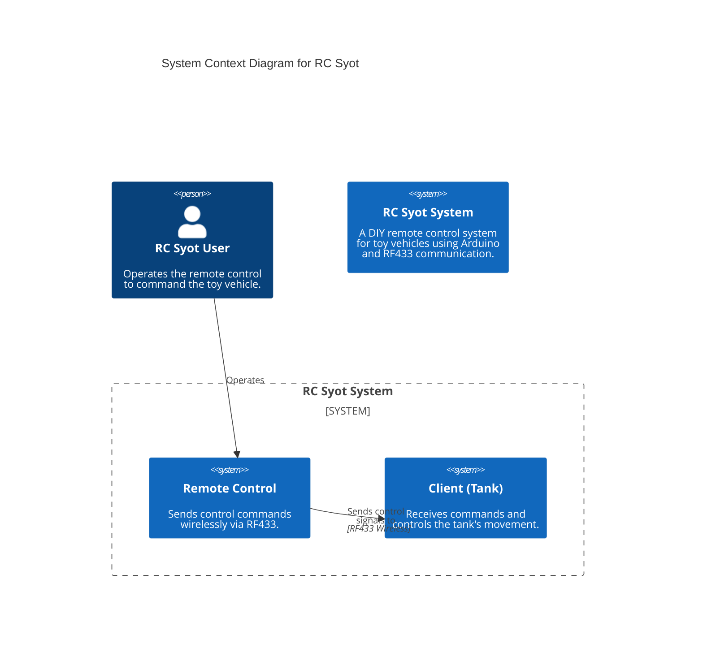

# RC Syot

"RC Syot" (Remote Control DIY) is a project dedicated to building your own remote-controlled toys using Arduino microcontrollers and common RF433 communication modules. This project provides the basic framework for creating a remote control transmitter and a receiver unit for a toy, demonstrated through a simple remote-controlled tank.

The goal of this project is to offer a hands-on approach to understanding basic wireless communication, microcontroller programming, and motor control in the context of DIY remote-controlled vehicles.

## Project Architecture Overview

The project is divided into two main components:

1.  **Remote Control (Transmitter):** This unit is responsible for sending control signals based on user input (e.g., joystick movements, button presses). It reads inputs and transmits corresponding commands wirelessly via an RF433 module.
2.  **Client (Receiver - Tank):** This unit is mounted on the remote-controlled toy (e.g., a tank). It receives commands from the remote control via an RF433 module and translates them into actions, such as controlling motors to move the tank.

Communication between the remote and the client is handled using simple RF433 modules, which are inexpensive and widely available.

## Top-Level Diagram



## Remote Control

The remote control part of this project is implemented in the `RCSyot/src/remote` directory, with the primary sketch being `remote_rf433.ino`. It typically involves:

*   **Input Devices:** Joysticks, buttons, or potentiometers for user input.
*   **Microcontroller:** An Arduino board (e.g., Arduino Uno, Nano) to read inputs and process commands.
*   **RF433 Transmitter:** To send encoded control signals wirelessly.

### PS2 Controller Button Functions

The remote control uses a PS2-style joystick. Here's a representation of the buttons and their assigned functions in the client (tank) firmware:

```text
        +--------------------------------------------------------------+
        |                                                              |
        |  L1 (Decrease Speed)            R1 (Increase Speed)          |
        |  L2                             R2                           |
        |                                                              |
        |       (SELECT)                          (START)              |
        |   (Change Melody)                    (Play Melody)           |
        |                                                              |
        |         _PAD_UP                 _TRIANGLE (Green Button)     |
        |            ^                    _SQUARE (Stop Motors)        |
        | _PAD_LEFT < > _PAD_RIGHT        _CIRCLE (Toggle Turn/Rotate) |
        |            v                    _CROSS (Red Button)          |
        |        _PAD_DOWN                                             |
        |                                                              |
        | Left Analog Stick               Right Analog Stick           |
        | (Left Motor Control)            (Right Motor Control)        |
        |                                                              |
        +--------------------------------------------------------------+
```

**Button Assignments:**

*   **Left Analog Stick (Left_Y):** Controls the left motor (forward/backward movement).
*   **Right Analog Stick (Right_Y):** Controls the right motor (forward/backward movement).
*   **DPAD Up (`PSB_PAD_UP`):** Move tank forward.
*   **DPAD Down (`PSB_PAD_DOWN`):** Move tank backward.
*   **DPAD Left (`PSB_PAD_LEFT`):** Turn tank left. If rotation mode is enabled (see `PSB_CIRCLE`), the left motor moves backward while the right motor moves forward.
*   **DPAD Right (`PSB_PAD_RIGHT`):** Turn tank right. If rotation mode is enabled (see `PSB_CIRCLE`), the right motor moves backward while the left motor moves forward.
*   **L1 (`PSB_L1`):** Decrease current PWM speed for motors.
*   **R1 (`PSB_R1`):** Increase current PWM speed for motors.
*   **Square (`PSB_SQUARE`):** Immediately stop both motors.
*   **Circle (`PSB_CIRCLE`):** Toggles the "turn with rotation" mode. When enabled, turning left/right with the D-pad will make the motors spin in opposite directions for tighter turns. A short buzzer sound indicates the state change.
*   **Start (`PSB_START`):** Plays the currently selected melody.
*   **Select (`PSB_SELECT`):** Changes to the next melody in the playlist. The number of short buzzer sounds indicates the new playlist number.
*   **L2, R2, L3, R3, Triangle, Cross:** Currently not assigned specific functions in the `tank_rf433.ino` sketch.

## Client (Tank)

The client part, specifically for a tank, is located in the `RCSyot/src/client` directory, with `tank_rf433.ino` as its main sketch. This component usually comprises:

*   **RF433 Receiver:** To receive control signals from the remote.
*   **Microcontroller:** An Arduino board to decode received signals and control actuators.
*   **Motor Driver:** To control the speed and direction of DC motors for movement.
*   **Motors:** To provide propulsion for the tank.

## Circuit Diagrams for Image Generation

To help visualize the hardware connections, detailed descriptions of the circuits for both the Remote Control and the Client (Tank) are provided below. These descriptions can be used to manually create circuit diagrams using various tools (e.g., Fritzing, KiCad, or drawing software).

### Remote Control Circuit Description

The Remote Control unit typically uses an Arduino Nano/Uno, an RF433MHz Transmitter module, a PS2 Joystick, and a Buzzer.

*   **Arduino Nano/Uno**
    *   **RF433MHz Transmitter Module:**
        *   VCC pin to Arduino 5V.
        *   GND pin to Arduino GND.
        *   DATA pin to Arduino Digital Pin 9 (D9).
    *   **PS2 Joystick:**
        *   VCC pin to Arduino 5V.
        *   GND pin to Arduino GND.
        *   DAT pin to Arduino Digital Pin 12 (D12).
        *   CMD pin to Arduino Digital Pin 11 (D11).
        *   SEL pin to Arduino Digital Pin 10 (D10).
        *   CLK pin to Arduino Digital Pin 13 (D13).
    *   **Buzzer:**
        *   One terminal to Arduino Digital Pin 6 (D6).
        *   Other terminal to Arduino GND.

### Client (Tank) Circuit Description

The Client (Tank) unit typically uses an Arduino Nano/Uno, an RF433MHz Receiver module, an L298N Motor Driver, two DC Motors, and a Buzzer.

*   **Arduino Nano/Uno**
    *   **RF433MHz Receiver Module:**
        *   VCC pin to Arduino 5V.
        *   GND pin to Arduino GND.
        *   DATA pin to Arduino Digital Pin 4 (D4).
    *   **L298N Motor Driver Module:**
        *   VCC (or 12V) pin to a separate power source (e.g., battery, 7-12V), and connect its GND to Arduino GND.
        *   IN1 pin to Arduino Digital Pin 11 (D11).
        *   IN2 pin to Arduino Digital Pin 6 (D6).
        *   IN3 pin to Arduino Digital Pin 3 (D3).
        *   IN4 pin to Arduino Digital Pin 5 (D5).
    *   **DC Motors:**
        *   Motor 1 terminals to L298N OUT1 and OUT2.
        *   Motor 2 terminals to L298N OUT3 and OUT4.
    *   **Buzzer:**
        *   One terminal to Arduino Digital Pin 2 (D2).
        *   Other terminal to Arduino GND.

## Project Assets

Here are some visual assets related to the project:

### Remote Control and Tank Overview


### Tank Driving Demonstration

A video demonstrating the tank in action:

[Drive Demonstration Video](/assets/drive.mp4)
